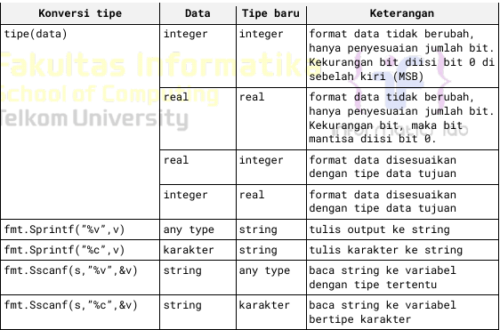

# Modul 1: Algoritma dan Pemrograman 2

## Pendahuluan
Modul ini adalah bagian dari praktikum mata kuliah **Algoritma dan Pemrograman 2** yang bertujuan untuk memberikan pemahaman komprehensif tentang penggunaan bahasa pemrograman **Go**. Dalam modul ini, kita akan menjelajahi struktur program Go, tipe data, variabel, hingga struktur kontrol yang penting seperti **perulangan** dan **percabangan**. Pemahaman yang mendalam tentang materi ini akan membantu dalam memecahkan masalah menggunakan pendekatan pemrograman yang efisien dan sistematis.

---

## 1. Struktur Program Go

Setiap bahasa pemrograman memiliki aturan dasar dalam penulisan kode, begitu juga Go. Struktur program Go memiliki elemen-elemen khusus yang harus dipahami sebelum mulai menulis kode yang lebih kompleks.

- **package main**: Setiap program Go dimulai dengan `package main`. Package ini menunjukkan bahwa file tersebut adalah program utama yang akan dieksekusi. Program Go dapat terdiri dari beberapa package, namun `package main` selalu diperlukan untuk program eksekusi.
- **func main()**: Fungsi `main()` adalah titik awal eksekusi dalam setiap program Go. Fungsi ini wajib ada di dalam file Go utama, dan semua logika program akan dijalankan dari sini.
- **Komentar dalam Go**: Komentar tidak akan dieksekusi dan berguna untuk dokumentasi kode.
  - **//** digunakan untuk komentar satu baris.
  - **/**...**/** digunakan untuk komentar beberapa baris.

**Contoh Program Sederhana**:

```go
package main

import "fmt"

func main() {
    var greetings = "Selamat Datang di Golang"
    var a, b int

    fmt.Println(greetings)
    fmt.Scanln(&a, &b)
    fmt.Printf("%v + %v = %v\n", a, b, a+b)
}
```

Program ini mencetak pesan, menerima input dari pengguna, dan melakukan operasi penjumlahan sederhana. Perhatikan bahwa variabel `greetings` dan variabel lain diinisialisasi dan digunakan dalam fungsi utama.

---

## 2. Koding, Kompilasi, dan Eksekusi Program Go

### 2.1 Koding
Menulis kode dalam Go pada dasarnya sama dengan bahasa pemrograman lainnya, namun ada beberapa konvensi yang harus diikuti:
- File Go disimpan dengan ekstensi `.go`.
- Setiap program Go disimpan dalam satu folder terpisah. Nama folder biasanya merepresentasikan nama program.
- Nama file Go bebas, namun sebaiknya mencerminkan isi dari program tersebut.

### 2.2 Kompilasi
Bahasa pemrograman dibagi menjadi dua kategori: **Interpreter** dan **Compiler**. Go adalah bahasa yang dikompilasi menggunakan `go build`, yang akan mengubah kode sumber menjadi program eksekusi. Proses ini memastikan bahwa kode bebas dari kesalahan sintaks dan memungkinkan optimasi sebelum program dijalankan.

### 2.3 Eksekusi
Setelah program dikompilasi, file eksekusi dapat dijalankan melalui terminal. Jangan menjalankan program Go dengan cara mengklik file `.exe` (di Windows) karena program ini berbasis teks.

### 2.4 Latihan
1. Selidiki Bahasa Pemrograman Dibawah ini, apakah termasuk bahasa compile atau bahasa interpreter. :
   - Pascal
   - C dan C++
   - Java
   - Python
2. Coba build dan run program sederhana diatas di device kalian masing-masing.

---

## 3. Tipe Data dan Variabel dalam Go

### 3.1 Variabel
Variabel adalah elemen penting dalam pemrograman yang memungkinkan kita menyimpan dan memanipulasi data dalam memori. Dalam Go, deklarasi variabel dilakukan dengan kata kunci `var`, atau dengan cara deklarasi implisit menggunakan `:=`.

- **Deklarasi eksplisit**:
  ```go
  var x int = 10
  ```
- **Deklarasi implisit**:
  ```go
  y := 20
  ```

### 3.2 Tipe Data
Go mendukung beberapa tipe data dasar, antara lain:
- **Integer**: `int`, `int8`, `int32`, `int64`, `uint`
- **Real**: `float32`, `float64`
- **Boolean**: `bool` (dengan nilai `true` dan `false`)
- **String**: Tipe data untuk menyimpan teks.

Contoh penggunaan tipe data di Go:

```go
var a int = 5
var b float64 = 12.34
var isGoFun bool = true
var greeting string = "Hello, Go!"
```
Implementasi Variable di Go juga memiliki pointer, pointer menyimpan suatu nilai kedalam alamat memory.

Contoh penggunaan pointer:
```go
var x int = 10
var ptr *int = &x

fmt.Println(x)  // output: 10
fmt.Println(ptr) // output: 0xc0000140a8
fmt.Println(*ptr) // output: 10
```

### Operasi pada Tipe Data
Tipe data dapat digunakan dalam berbagai operasi seperti penjumlahan, pengurangan, dan lainnya. Berikut adalah beberapa operator dasar dalam Go:

Operasi Numerik :
- **+**: Penjumlahan (bisa juga untuk konkatenasi string)
- **-**: Pengurangan
- **/**: Pembagian
- **%**: Modulus (sisa pembagian)

Operasi Lainnya :
- **&, |, ^, &^**: Operasi perbit (AND, OR, XOR, AND-NOT)
- **<< >>**: Operasi Geser Bit kiri/kanan sebanyak integer yang diberikan
- **< <=, >=, >, ==, !=**: Operasi Komparasi (compare)
- **&&, ||**: Operasi komparasi yang menghasilkan nilai TRUE/FALSE (Hanya bisa digunakan di tipedata selain boolean) 

Contoh operasi pada tipe data:

```go
result := 10 + 20 // Penjumlahan integer
text := "Go" + "Lang" // Konkatenasi string
```

Bahasa Go memiliki strict rule atau aturan yang ketat. Maksudnya adalah tipe data yang berbeda tidak boleh dicampur dalam 1 expression, bahkan tipe data yang masih sejenis, misal masih sama sama integer (Int dan Int32). Untuk menyesuaikan tipedata, ada beberapa cara yang bisa dilakukan:
- Casting tipe data, mengubah tipe data ke tipe data yang diinginkan.
- Memanfaatkan fungsi `Sprint` dan `Sscan` dari paket `fmt`.
- Memanfaatkan fungsi-fungsi dalam paket `strconv`, seperti `Atoi`, `Itoa`, dan `ParseBool`.

Contoh :
```go
// Pembagian antara float dengan int
2020.0 % 19 // will be an illegal expression error

// Untuk mengatasi error tersebut, float bisa di convert menjadi int
int(2020.0) % 19 // 6
```

Untuk semua fungsi konversi bisa kalian lihat di tabel dibawah ini:


### Konstanta Simbolik
Konstanta dapat diberi nama untuk memudahkan mengingat maksud dan manfaat dari nilai yang diberi nama tersebut. Seperti PI untuk merepresentasikan konstanta dari 'PHI' Matematika.
```go
const PI = 3.1415926535897
const MARKER = "AKHIR"
```
``Catatan: Penulisan konstanta memiliki aturan tidak tertulis yaitu harus menggunakan huruf kapital semua``

### Soal Latihan
1. Telusuri program berikut dengan cara mengcompile program dan mengexecutenya. Silahkan masukkan data yang sesuai sebanyak yang diminta program. Perhatikan output yang diperoleh. Coba telaah apa yang sebenarnya dilakukan program tersebut?
```go
package main
import "fmt"

func main() {
    var (
        satu, dua, tiga string
        temp string
    )
    fmt.Print("Masukkan input string: ")
    fmt.Scanln(&satu)
    fmt.Print("Masukkan input string: ")
    fmt.Scanln(&dua)
    fmt.Print("Masukkan input string: ")
    fmt.Scanln(&tiga)
    fmt.Println("Output awal = " + satu + " " + dua + " " + tiga)
    temp = satu
    satu = dua
    dua = tiga
    tiga = temp
    fmt.Println("Output akhir = " + satu + " " + dua + " " + tiga)
}
```
2. Tipe data ``char`` sebenarnya hanya apa yang tampak dalam tampilan. Di dalam karakter tersebut tersimpan dalam bentuk biner 8 bit atau 32 bit saja. Buat program ASCII yang akan membaca 5 data integer dan mencetaknya dalam format karakter. Kemudian membaca 3  data karakter dan mencetak 3 karakter setelah karakter tersebut (menurut tabel ASCII).

Input : Terdiri dari dua baris. Baris pertama berisi 5 data integer. Data integer memiliki value antara 32-127. Baris kedua berisi 3 karakter tanpa spasi.
```
66 97 103 117 115
SNO
```

Output : Terdiri dari 2 baris. Baris pertama representasi karakter dari data integer yang diberikan dan tanpa dipisahkan spasi. Baris kedua berisi 3 karakter (juga tidak dipisahkan oleh spasi).
```
Bagus
TOP
```
``Catatan : Gunakan fmt.Scanf("%c", &var) untuk pembacaan satu karakter dan fmt.Printf("%c", var) untuk penulisan satu karakter.``

---

## 4. Struktur Kontrol Perulangan dalam Go

Go mendukung satu jenis perulangan dengan kata kunci `for`. Namun, `for` dapat digunakan dalam berbagai cara yang fleksibel:

### 4.1 Perulangan dengan Inisialisasi, Kondisi, dan Update
Ini adalah bentuk umum yang digunakan untuk perulangan dalam banyak bahasa pemrograman.

```go
for i := 0; i < 10; i++ {
    fmt.Println(i)
}
```

### 4.2 Perulangan Berdasarkan Kondisi
Dalam bentuk ini, perulangan terus dilakukan selama kondisinya terpenuhi.

```go
i := 0
for i < 10 {
    fmt.Println(i)
    i++
}
```

### 4.3 Perulangan Tak Terbatas
Tanpa kondisi apa pun, perulangan akan berjalan terus menerus sampai ditemukan perintah untuk berhenti (`break`).

```go
for {
    fmt.Println("Loop tanpa henti")
    break // Digunakan untuk menghentikan loop
}
```

---

## 5. Struktur Kontrol Percabangan

Go menyediakan dua jenis kontrol percabangan utama: **if-else** dan **switch-case**.

### 5.1 If-Else
`if` digunakan untuk menjalankan perintah ketika kondisi tertentu terpenuhi. Jika tidak terpenuhi, blok `else` dapat digunakan.

```go
if x > 10 {
    fmt.Println("x lebih besar dari 10")
} else {
    fmt.Println("x kurang dari atau sama dengan 10")
}
```

### 5.2 Switch-Case
`switch` digunakan untuk memilih eksekusi berdasarkan beberapa kondisi.

```go
switch day {
case "Monday":
    fmt.Println("Hari Senin")
case "Tuesday":
    fmt.Println("Hari Selasa")
default:
    fmt.Println("Hari tidak diketahui")
}
```

---

## Latihan

### Latihan 1: Volume dan Luas Permukaan Bola
Buat program yang menerima input jari-jari bola dan menghitung:
- **Volume**: \( V = \frac{4}{3} \pi r^3 \)
- **Luas Permukaan**: \( A = 4 \pi r^2 \)

Contoh:

```go
package main

import "fmt"
import "math"

func main() {
    var r float64
    fmt.Print("Masukkan jari-jari bola: ")
    fmt.Scanln(&r)

    volume := (4.0 / 3.0) * math.Pi * math.Pow(r, 3)
    area := 4 * math.Pi * math.Pow(r, 2)

    fmt.Printf("Volume: %v\nLuas Permukaan: %v\n", volume, area)
}
```

### Latihan 2: Tahun Kabisat
Buat program yang menerima input tahun dan memeriksa apakah tahun tersebut adalah **tahun kabisat**.

Kondisi tahun kabisat:
- Habis dibagi 4, tetapi tidak habis dibagi 100, atau
- Habis dibagi 400.

Contoh kode:

```go
package main

import "fmt"

func main() {
    var year int
    fmt.Print("Masukkan tahun: ")
    fmt.Scanln(&year)

    if (year % 4 == 0 && year % 100 != 0) || (year % 400 == 0) {
        fmt.Println(year, "adalah tahun kabisat.")
    } else {
        fmt.Println(year, "bukan tahun kabisat.")
    }
}
```
---

## Lisensi
Modul ini dilisensikan di bawah [MIT License](https://opensource.org/licenses/MIT). Anda bebas menggunakan dan memodifikasi materi ini sesuai kebutuhan, dengan tetap mempertahankan informasi lisensi.

