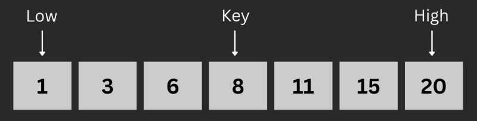
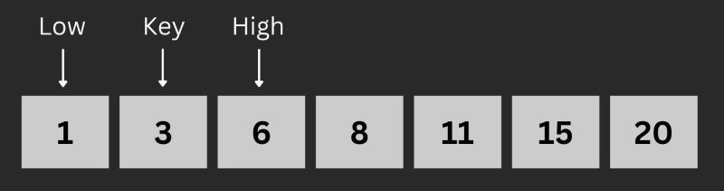
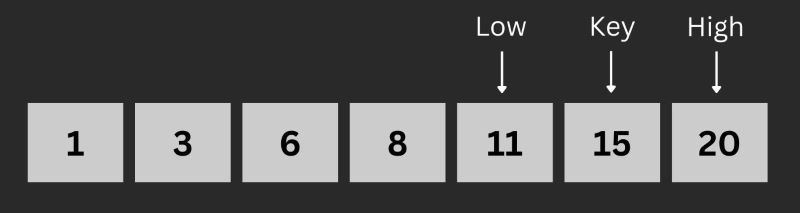

# Searching Algorithm
Searching algorithm atau algoritma pencarian merupakan algoritma yang digunakan untuk mencari sebuah item dalam sebuah kumpulan data. Terdapat banyak jenis algoritma pencarian seperti sequential searching, binary searching, jump searching, interpolation searching, dan banyak lagi. 

# Sequential Searching
Sequential searching atau biasa disebut linear searching merupakan algoritma pencarian dasar yang melakuan pencarian item di dalam data dengan bentuj baris atau list. Pencarian menggunakan sequential searching sangat mudah yaitu dilakukan dengan memeriksa satu per satu data secara berurutan untuk memastikan kecocokan antara tiap-tiap data dengan data yang dicari. Data-data yang dicari dapat beraneka ragam, menyesuaikan dari kebutuhan program.

Berikut merupakan ilustrasi dari sequential searching :


Kelebihan dari algoritma ini adalah sangat mudah diimplementasikan, namun algoritma ini juga memiliki kelemahan yaitu membutuhkan waktu pemrosesan yang besar ketika data yang dicari terdapat di dalam kumpulan data yang sangat besar.

Berikut merupakan contoh kode program `Sequential Search` :

``````go
package main

import (
	"fmt"
)

func sequentialSearch(cari int, arr []int) int {
	for i, val := range arr {
		if cari == val {
			return i
		}
	}
	return -1
}

func main() {
	barisAngka := []int{1, 2, 3, 4, 5, 6, 7, 8, 9, 10}
	var cari int

	fmt.Print("Masukkan angka yang dicari: ")
	fmt.Scan(&cari)

	resultIndex := sequentialSearch(cari, barisAngka)
	if resultIndex == -1 {
		fmt.Println("Angka tidak ditemukan")
	} else {
		fmt.Printf("Angka %d ada di index %d\n", cari, resultIndex)
	}
}

``````

# Binary Search
Binary Search merupakan sebuah algoritma **pencarian** untuk mencari nilai tertentu dalam sebuah **array linear**, dengan cara menghilangkan setengah porsi array pada setiap pengulangannya.

### Cara Kerja Binary Search : 
1. Dimulai dari index tengah dari sebuah array sebagai _**Search Key**_, _**low**_ sebagai batas kiri, dan _**high**_ sebagai batas kanan.

1. Jika nilai dari _**Search Key**_ sama dengan nilai yang dicari, maka 
   kembalikan nilai _**Search Key**_.
2. Atau jika nilai yang dicari **lebih kecil** dari _**Search Key**_, maka persempit area pencarian ke bagian bawah dengan memindahkan _**high**_ kesisi kiri _**Search Key**_.

1. Sebaliknya jika nilai yang dicari **lebih besar** dari _**Search Key**_, maka persempit area pencarian ke bagian atas dengan memindahkan _**low**_ kesisi kanan _**Search Key**_.

1. Periksa berulang kali dari poin nomor dua hingga nilainya ditemukan atau intervalnya kosong.

### Contoh implementasi Binary Search dalam bahasa C
`````` go
package main

import (
	"fmt"
)

func binarySearch(cari int, arr []int, right int) int {
	left := 0
	for left <= right {
		mid := (left + right) / 2
		fmt.Printf("awal[%d], tengah[%d], akhir[%d]\n", left, mid, right)
		if cari == arr[mid] {
			return mid
		}
		if cari > arr[mid] {
			left = mid + 1
		} else {
			right = mid - 1
		}
	}
	return -1
}

func main() {
	barisAngka := []int{1, 2, 3, 4, 5, 6, 7, 8, 9, 10}
	var cari int

	fmt.Print("Masukkan angka yang dicari: ")
	fmt.Scan(&cari)

	resultIndex := binarySearch(cari, barisAngka, len(barisAngka)-1)
	if resultIndex == -1 {
		fmt.Println("Angka tidak ditemukan")
	} else {
		fmt.Printf("Angka %d ada di index %d\n", cari, resultIndex)
	}
}
``````

# Sequential Search vs Binary Search


# Soal Latihan
1. Buatlah array 2 dimensi dengan ukuran 3x3 dan lakukan pencarian terhadap suatu angka di dalam array 2 dimensi tersebut. Jika angka ditemukan, outputkan baris dan kolom dari angka tersebut dan jika tidak, maka outputkan angka tidak ditemukan.
   
   Input :
   ``````
   5
   ``````
   Output :
   ``````
   Angka 5 berada pada baris ke 0 kolom ke 2.
   ``````
2. Dalam penulisan syntax dalam pemrograman, terdapat beberapa konvensi. Salah satunya adalah `snake_case` dan `camelCase`. Diberikan sebuah input nama variabel dalam penulisan `snake_case`, misalnya `is_variable_true`. Buatlah program untuk mengubah penulisan tersebut menjadi `camelCase`, yaitu `isVariableTrue`. Test case input dipastikan berupa `snake_case`.

    Input:
    ```
    is_sorted_array
    ```
    
    Output:
    ```
    isSortedArray
    ```

3. Buatlah Sequential Algoritm dengan menggunakan while looping.
4. Kamu diminta untuk menebak sebuah angka rahasia dalam rentang 1 hingga n. Sistem akan memberimu informasi apakah tebakanmu:
   - terlalu kecil ("low"),
   - terlalu besar ("high"), atau
   - benar ("correct").
   - Gunakan binary search untuk menebak angka tersebut dengan jumlah tebakan sesedikit mungkin.

```go
package main

import "fmt"

// Disediakan oleh sistem (simulasi untuk testing lokal)
var secret = 6

func guess(num int) string {
	return "" // TODO: Lengkapi logika perbandingan
}

func guessNumber(n int) int {
	low := 1
	high := n

	for low <= high {
		mid := 0 // TODO: Hitung mid dengan benar

		// Panggil fungsi guess
		result := guess(mid)

		// TODO: Lengkapi logika pengambilan keputusan
		// Jika "correct", return mid
		// Jika "low", perbarui low
		// Jika "high", perbarui high
	}

	// Jika tidak ditemukan (opsional, seharusnya tidak terjadi)
	return -1
}

func main() {
	n := 10
	result := guessNumber(n)
	fmt.Printf("Angka rahasia adalah: %d\n", result)
}


```

Contoh Output :
```
Angka rahasia adalah: 6
```