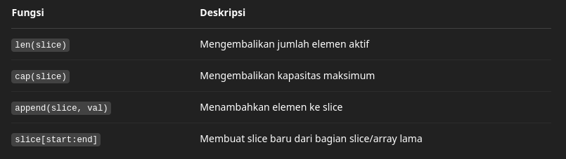

# Modul 7 - Array (Bahasa Go)

Modul ini menjelaskan penggunaan struktur data **Array** dalam bahasa pemrograman Go. Materi mencakup deklarasi array, akses elemen, penggunaan fungsi `len`, serta slice (array dinamis) yang umum digunakan dalam pengembangan perangkat lunak.

---

## 📌 Pengertian Array

**Array** adalah struktur data statis yang menyimpan kumpulan elemen dengan tipe data yang sama dalam jumlah tetap. Ukuran array harus diketahui saat deklarasi dan tidak bisa berubah setelahnya. Isi didalam array umumnya dinamakan index, dan index ini dimulai dari 0.


---

## 🛠️ Notasi Deklarasi Array dalam Go

```go
var (
    arr [73]CircType2                     // array dengan 73 elemen bertipe CircType2
    buf = [5]byte{7, 3, 5, 2, 11}         // array 5 elemen dengan nilai awal
    mhs [2000]NewType                     // array mahasiswa
    rec [20][40]float64                   // array multidimensi (matriks)
)
```

---

## 📏 Ukuran dan Indeks
- Ukuran array dapat diperoleh dengan fungsi len().
- Indeks array dimulai dari 0 sampai len(array)-1.

```go
arr[0] = arr[7]                  // Salin nilai dari elemen ke-7 ke elemen ke-0
currX := arr[i].center.x        // Mengakses field 'x' dari elemen ke-i
buf := arr[len(arr)-1]          // Mengambil elemen terakhir
```

---

## 📌 Slice (Array Dinamis)
Slice adalah array dinamis yang ukurannya bisa berubah saat program berjalan. Slice sangat fleksibel dan banyak digunakan dalam pemrograman Go modern.

Deklarasi:
```go
var chop []float64                    // slice kosong bertipe float64
var sl01 = []int{11, 2, 3, 5, 7, 13}  // slice dengan nilai awal
```

Prealokasi slice:
```go
sl02 := make([]int, 10, 20)          // 10 elemen digunakan, 20 kapasitas
sl03 := make([]circType, 7)          // slice dengan 7 elemen
```

---

## 📈 Fungsi Built-in Slice


Contoh Penggunaan:
```go
fmt.Println(len(sl02), cap(sl02))  // Output: 10 20
sl01 = append(sl01, 17, 19, 23)    // Menambah beberapa elemen
sl04 := arr[:4]                    // 4 elemen pertama
sl05 := sl01[5:]                   // Elemen dari indeks 5 sampai akhir
sl06 := sl05[:]                    // Menyalin seluruh isi sl05
sl07 := sl06[3:5]                  // Slice dari indeks 3 ke 4
```

---

## 📚 Latihan Soal (Rekomendasi)
1. Buat array berisi bilangan bulat sejumlah N, tampilkan:
   - Seluruh isi array
   - Elemen dengan indeks ganjil
   - Elemen dengan indeks genap
   - Elemen dengan indeks kelipatan X
   - Rata-rata dan simpangan baku dari isi array
   - Frekuensi kemunculan suatu angka
   - Hapus elemen array pada indeks tertentu

  Contoh Input
  ```yaml
    Masukkan jumlah elemen (N): 6
    Masukkan elemen array: 5 3 7 8 3 5
    Masukkan nilai X: 2
    Masukkan angka untuk dihitung frekuensinya: 5
    Masukkan indeks yang ingin dihapus: 3
  ```
  Contoh Output
  ```yaml
    Isi array: [5 3 7 8 3 5]
    Indeks genap: [5 7 3]
    Indeks ganjil: [3 8 5]
    Indeks kelipatan 2: [5 7 3]
    Rata-rata: 5.17
    Simpangan baku: 1.94
    Angka 5 muncul sebanyak 2 kali
    Array setelah menghapus indeks 3: [5 3 7 3 5]
  ```
2. Buat program yang menyimpan nama-nama klub sepak bola pemenang berdasarkan input hasil pertandingan.

Contoh Input
```yaml
Masukkan nama klub pemenang: Emyu
Masukkan nama klub pemenang: Arsenal
Masukkan nama klub pemenang: Madrid
Masukkan nama klub pemenang: SELESAI
```

Contoh Output
```yaml
Daftar klub pemenang: [Emyu Arsenal Madrid]
Total klub pemenang: 3
```